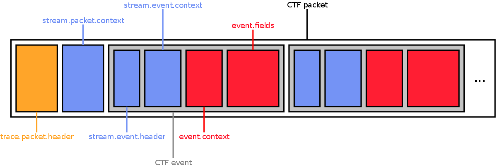

barectf
=======

**barectf** is a command-line utility which generates pure C99
code that is able to write native
[CTF](http://git.efficios.com/?p=ctf.git;a=blob_plain;f=common-trace-format-specification.txt;hb=master)
(the Common Trace Format) out of a pre-written CTF metadata file.

You will find barectf interesting if:

  1. You need to trace a program.
  2. You need tracing to be as fast as possible, but also very flexible:
     record integers of custom sizes, custom floating point numbers,
     enumerations mapped to a specific integer type, structure fields,
     NULL-terminated strings, static and dynamic arrays, etc.
  3. You need to be able to convert the recorded binary events to
     human-readable text, as well as analyze them with Python scripts
     ([Babeltrace](http://www.efficios.com/babeltrace) does all that,
     given a CTF input).
  4. You _cannot_ use [LTTng](http://lttng.org/), an efficient tracing
     framework for the Linux kernel and Linux/BSD user applications, which
     outputs CTF.

The target audience of barectf is developers who need to trace bare metal
systems (without an operating system). The code produced by barectf
is pure C99 and is lightweight enough to fit on a tiny microcontroller.
Each event described in the CTF metadata input becomes one C function with
one parameter mapped to one event field. CTF data is recorded in a buffer of
any size provided by the user. This buffer corresponds to one CTF packet.
The generated tracing functions report when the buffer is full. The user
is entirely responsible for the buffering scheme: leave the buffer in memory,
save it to some permanent storage, swap it with another empty buffer and
concatenate recorded packets, etc.

barectf is written in Python 3 and currently uses
[pytsdl](https://github.com/eepp/pytsdl) to parse the CTF metadata file
provided by the user.


installing
----------

Make sure you have `pip` for Python 3. On the latest Ubuntu releases,
it is called `pip3`:

    sudo apt-get install python3-pip

On Ubuntu 12.04, you need to install `setuptools` first, then use
`easy_install3` to install `pip3`:

    sudo apt-get install python3-setuptools
    sudo easy_install3 pip

Install barectf:

    sudo pip3 install barectf


using
-----

Using barectf involves:

  1. Writing the CTF metadata file describing the various headers,
     contexts and event fields.
  2. Running the `barectf` command to generate C99 files out of
     the CTF metadata file.
  3. Using the generated C code in your specific application.

The following subsections explain the three steps above.


### writing the CTF metadata

The **Common Trace Format** is a specialized file format for recording
trace data. CTF is designed to be very fast to write and very flexible.
All headers, contexts and event fields written in binary files are
described using a custom C-like, declarative language, TSDL (Trace
Stream Description Language). The file containing this description is
called the **CTF metadata**. The latter may be automatically generated
by a tracer, like it is the case of LTTng, or written by hand. This
metadata file is then used by CTF trace readers to know the layout of
CTF binary files containing actual event contexts and fields.

The CTF metadata file contains several blocks describing various CTF
binary layouts. A CTF trace file is a concatenation of several CTF
packets. Here's the anatomy of a CTF packet:



A CTF packet belongs to a specific CTF stream. While the packet header
is the same for all streams of a given CTF trace, everything else is
specified per stream. Following this packet header is a packet context,
and then actual recorded events. Each event starts with a mandatory
header (same event header for all events of a given stream). The event
header is followed by an optional event context with a layout shared
by all events of a given stream. Then follows another optional event
context, although this one has a layout specific to the event type.
Finally, event fields are written.

barectf asks you to write the CTF metadata by hand. Although its official
[specification](http://git.efficios.com/?p=ctf.git;a=blob_plain;f=common-trace-format-specification.txt;hb=master)
is thorough, you will almost always start from this template:

```
/* CTF 1.8 */

// a few useful standard integer aliases
typealias integer {size = 8; align = 8;}                  := uint8_t;
typealias integer {size = 16; align = 16;}                := uint16_t;
typealias integer {size = 32; align = 32;}                := uint32_t;
typealias integer {size = 64; align = 64;}                := uint64_t;
typealias integer {size = 8; align = 8; signed = true;}   := int8_t;
typealias integer {size = 16; align = 16; signed = true;} := int16_t;
typealias integer {size = 32; align = 32; signed = true;} := int32_t;
typealias integer {size = 64; align = 64; signed = true;} := int64_t;

// IEEE 754 standard-precision floating point alias
typealias floating_point {
    exp_dig = 8;
    mant_dig = 24;
    align = 32;
} := float;

// IEEE 754 double-precision floating point alias
typealias floating_point {
    exp_dig = 11;
    mant_dig = 53;
    align = 64;
} := double;

// trace block
trace {
    // CTF version 1.8; leave this as is
    major = 1;
    minor = 8;

    /* Native byte order (`le` or `be`). This is used by barectf to generate
     * the appropriate code when writing data to the packet.
     */
    byte_order = le;

    /* Packet header. All packets (buffers) will have the same header.
     *
     * Special fields recognized by barectf (must appear in this order):
     *
     *   magic:     will be set to CTF's magic number (must be the first field)
     *              (32-bit unsigned integer)
     *   stream_id: will be set to the ID of the stream associated with
     *              this packet (unsigned integer of your choice) (mandatory)
     */
    packet.header := struct {
        uint32_t magic;
        uint32_t stream_id;
    };
};

// environment variables; you may add custom entries
env {
    domain = "bare";
    tracer_name = "barectf";
    tracer_major = 0;
    tracer_minor = 1;
    tracer_patchlevel = 0;
};

// clock descriptor
clock {
    // clock name
    name = my_clock;

    // clock frequency (Hz)
    freq = 1000000000;

    // optional clock value offset (offfset from Epoch is: offset * (1 / freq))
    offset = 0;
};

// alias for integer used to hold clock cycles
typealias integer {
    size = 32;

    // map to the appropriate clock using its name
    map = clock.my_clock.value;
} := my_clock_int_t;

/* A stream. You may have as many streams as you want. Events are unique
 * within their own stream. The main advantage of having multiple streams
 * is having different event headers, stream event contexts and stream
 * packet contexts for each one.
 */
stream {
    /* Mandatory stream ID (must fit the integer type of
     * `trace.packet.header.stream_id`.
     */
    id = 0;

    /* Mandatory packet context. This structure follows the packet header
     * (see `trace.packet.header`) immediately in CTF binary streams.
     *
     * Special fields recognized by barectf:
     *
     *   timestamp_begin: will be set to the current clock value when opening
     *                    the packet (same integer type as the clock's value)
     *   timestamp_end:   will be set to the current clock value when closing
     *                    the packet (same integer type as the clock's value)
     *   content_size:    will be set to the content size, in bits, of this
     *                    stream (unsigned 32-bit or 64-bit integer) (mandatory)
     *   packet_size:     will be set to the packet size, in bits, of this
     *                    stream (unsigned 32-bit or 64-bit integer) (mandatory)
     *   cpu_id:          if present, the barectf_open_packet() function of this
     *                    stream will accept an additional parameter to specify the
     *                    ID of the CPU associated with this stream (a given
     *                    stream should only be written to by a specific CPU)
     *                    (unsigned integer of your choice)
     *
     * `timestamp_end` must be present if `timestamp_begin` exists.
     */
    packet.context := struct {
        my_clock_int_t timestamp_begin;
        my_clock_int_t timestamp_end;
        uint64_t content_size;
        uint64_t packet_size;
        uint32_t cpu_id;
    };

    /* Mandatory event header. All events recorded in this stream will start
     * with this structure.
     *
     * Special fields recognized by barectf:
     *
     *   id:        will be filled by the event ID corresponding to a tracing
     *              function (unsigned integer of your choice)
     *   timestamp: will be filled by the current clock's value (same integer
     *              type as the clock's value)
     */
    event.header := struct {
        uint32_t id;
        my_clock_int_t timestamp;
    };

    /* Optional stream event context (you may remove the whole block or leave
     * the structure empty if you don't want any). This structure follows the
     * event header (see `stream.event.header`) immediately in CTF binary streams.
     */
    event.context := struct {
        int32_t _some_stream_event_context_field;
    };
};

/* An event. Events have an ID, a name, an optional context and fields. An
 * event is associated to a specific stream using its stream ID.
 */
event {
    /* Mandatory event name. This is used by barectf to generate the suffix
     * of this event's corresponding tracing function, so make sure it follows
     * the C identifier syntax even though it's a quoted string here.
     */
    name = "my_event";

    /* Mandatory event ID (must fit the integer type of
     * in `stream.event.header.id` of the associated stream).
     */
    id = 0;

    // ID of the stream in which this event will be recorded
    stream_id = 0;

    /* Optional event context (you may remove the whole block or leave the
     * structure empty if you don't want one). This structure follows the
     * stream event context (if it exists) immediately in CTF binary streams.
     */
    context := struct {
        int32_t _some_event_context_field;
    };

    /* Mandatory event fields (although the structure may be left empty if this
     * event has no fields). This structure follows the event context (if it
     * exists) immediately in CTF binary streams.
     */
    fields := struct {
        uint32_t _a;
        uint32_t _b;
        uint16_t _c;
        string _d;
    };
};
```

The top `/* CTF 1.8 */` is actually needed right there, and as is, since it
acts as a CTF metadata magic number for CTF readers.

Only one stream and one event (belonging to this single stream) are described
in this template, but you may add as many as you need.

The following subsections describe the features of CTF metadata supported
by barectf.


#### types

The supported structure field types are:

  * **integers** of any size (64-bit and less), any alignment (power of two)
  * **floating point numbers** of any total size (64-bit and less), any
    alignment (power of two)
  * NULL-terminated **strings** of bytes
  * **enumerations** associated with a specific integer type
  * **static** and **dynamic arrays** of any type
  * **structures** containing only integers, floating point numbers,
    enumerations and _static_ arrays

CTF also supports _variants_ (dynamic selection between different types),
but barectf **does not**. Any detected variant will throw an error when
running `barectf`.


##### integers

CTF integers are defined like this:

```
integer {
    // mandatory size in bits (64-bit and less)
    size = 16;

    /* Optional alignment in bits (power of two). Default is 8 when the
     * size is a multiple of 8, and 1 otherwise.
     */
    align = 16;

    // optional signedness (`true` or `false`); default is unsigned
    signed = true;

    /* Optional byte order (`le`, `be`, `native` or `network`). `native`
     * will use the byte order specified by the `trace.byte_order`.
     * Default is `native`.
     */
    byte_order = le;

    /* Optional display base, used to display the integer value when
     * reading the trace. Valid values are 2 (or `binary`, `bin` and `b`),
     * 8 (or `o`, `oct` or `octal`), 10 (or `u`, `i`, `d`, `dec` or
     * `decimal`), and 16 (or `x`, `X`, `p`, `hex` or `hexadecimal`).
     * Default is 10.
     */
    base = hex;

    /* Encoding (if this integer represents a character). Valid values
     * are `none`, `UTF8` and `ASCII`. Default is `none`.
     */
    encoding = UTF8;
}
```

The size (the only mandatory property) does _not_ have to be a power of two:

```
integer {size = 23;}
```

is perfectly valid.

A CTF integer field will make barectf produce a corresponding C integer
function parameter with an appropriate size. For example, the 23-bit integer
above would produce an `uint32_t` parameter (of which only the first 23
least significant bits will be written to the trace), while the first
16-bit one will produce an `int16_t` parameter.

The `integer` block also accepts a `map` property which is only used
when defining the integer used to carry the value of a specified
clock. You may always follow the example above.


##### floating point numbers

CTF floating point numbers are defined like this:

```
floating_point {
    // exponent size in bits
    exp_dig = 8;

    // mantissa size in bits
    mant_dig = 24;

    /* Optional alignment (power of two). Default is 8 when the total
     * size (exponent + mantissa) is a multiple of 8, and 1 otherwise.
     */
    align = 32;

    /* Optional byte order (`le`, `be`, `native` or `network`). `native`
     * will use the byte order specified by the `trace.byte_order`.
     * Default is `native`.
     */
    byte_order = le;
}
```

If a CTF floating point number is defined with an 8-bit exponent, a 24-bit
mantissa and a 32-bit alignment, its barectf C function parameter type will
be `float`. It will be `double` for an 11-bit exponent, 53-bit mantissa
and 64-bit aligned CTF floating point number. Any other configuration
will produce a `uint64_t` function parameter (you will need to cast your
custom floating point number to this when calling the tracing function).


##### strings

CTF strings are pretty simple to define:

```
string
```

They may also have an encoding property:

```
string {
    // encoding: `none`, `UTF8` or `ASCII`; default is `none`
    encoding = UTF8;
}
```

CTF strings are always byte-aligned.

A CTF string field will make barectf produce a corresponding C function
parameter of type `const char*`. Bytes will be copied from this pointer
until a byte of value 0 is found (which will also be written to the
buffer to mark the end of the recorded string).


##### enumerations

CTF enumerations associate labels to ranges of integer values. They
are a great way to trace named states using an integer. Here's an
example:

```
enum : uint32_t {
    ZERO,
    ONE,
    TWO,
    TEN = 10,
    ELEVEN,
    "label with spaces",
    RANGE = 23 ... 193
}
```

Unless the first entry specifies a value, CTF enumerations are
always started at 0. They work pretty much like their C counterpart,
although they support ranges and literal strings as labels.

CTF enumerations are associated with a CTF integer type (`uint32_t`
above). This identifier must be an existing integer type alias.

A CTF enumeration field will make barectf produce a corresponding C
integer function parameter compatible with the associated CTF integer type.


##### static arrays

Structure field names may be followed by a subscripted constant to
define a static array of the field type:

```
struct {
    integer {size = 16;} _field[10];
}
```

In the above structure, `_field` is a static array of ten 16-bit integers.

A CTF static array field will make barectf produce a `const void*` C function
parameter. Bytes will be copied from this pointer to match the total static
array size. In the example above, the integer size is 16-bit, thus its
default alignment is 8-bit, so 20 bytes would be copied.

The inner element of a CTF static array _must be at least byte-aligned_
(8-bit), either by forcing its alignment, or by ensuring it manually
when placing fields one after the other. This means the following static
array is valid for barectf:

```
struct {
  // ...
    integer {size = 5;} _field[10];
}
```

as long as the very first 5-bit, 1-bit aligned integer element starts
on an 8-bit boundary.


##### dynamic arrays

Just like static arrays, dynamic arrays are defined using a subscripted
length, albeit in this case, this length refers to another field using
the dot notation. Dynamic arrays are called _sequences_ in the CTF
specification.

Here's an example:

```
struct {
    uint32_t _length;
    integer {size = 16;} _field[_length];
}
```

In the above structure, `_field` is a dynamic array of `_length`
16-bit integers.

There are various scopes to which a dynamic array may refer:

  * no prefix: previous field in the same structure, or in parent
    structures until found
  * `event.fields.` prefix: field of the event fields
  * `event.context.` prefix: field of the event context if it exists
  * `stream.event.context.` prefix: field of the stream event context
    if it exists
  * `stream.event.header.` prefix: field of the event header
  * `stream.packet.context.` prefix: field of the packet context
  * `trace.packet.header.` prefix: field of the packet header
  * `env.` prefix: static property of the environment block

Here's another, more complex example:

```
struct {
    uint32_t _length;
    string _other_field[stream.event.context.length];
    float _static_array_of_dynamic_arrays[10][_length];
}
```

The above examples also demonstrates that dynamic arrays and static
arrays may contain eachother. `_other_field` is a dynamic array of
`stream.event.context.length` strings. `_static_array_of_dynamic_arrays`
is a static array of 10 dynamic arrays of `_length` floating point
numbers. This syntax follows the C language.

A CTF dynamic array field will make barectf produce a `const void*` C function
parameter. Bytes will be copied from this pointer to match the
total dynamic array size. The previously recorded length will be
found automatically (always an offset from the beginning of the
stream packet, or from the beginning of the current event).

barectf has a few limitations concerning dynamic arrays:

  * The inner element of a CTF dynamic array _must be at least byte-aligned_
    (8-bit), either by forcing its alignment, or by ensuring it manually
    when placing fields one after the other.
  * The length type must be a 32-bit, byte-aligned unsigned integer
    with a native byte order.


##### structures

Structures contain fields associating a name to a type. The fields
are recorded in the specified order within the CTF binary stream.

Here's an example:

```
struct {
    uint32_t _a;
    int16_t _b;
    string {encoding = ASCII;} _c;
}
```

The default alignment of a structure is the largest alignment amongst
its fields. For example, the following structure has a 32-bit alignment:

```
struct {
    uint16_t _a;             // alignment: 16
    struct {                 // alignment: 32
        uint32_t _a;         // alignment: 32
        string; _b;          // alignment: 8
    } _b;
    integer {size = 64;} _c; // alignment: 8
}
```

This default alignment may be overridden using a special `align()`
option after the structure is closed:

```
struct {
    uint16_t _a;             // alignment: 16
    struct {                 // alignment: 32
        uint32_t _a;         // alignment: 32
        string; _b;          // alignment: 8
    } _b;
    integer {size = 64;} _c; // alignment: 8
} align(16)
```

You may use structures as field types, although they must have a
_known size_ when running barectf. This means they cannot contain
sequences or strings.

A CTF structure field will make barectf produce a `const void*` C function
parameter. The structure (of known size) will be copied as is to the
current buffer, respecting its alignment.

Note that barectf requires inner structures to be at least byte-aligned.

Be careful when using CTF structures for recording binary structures
declared in C. You need to make sure your C compiler aligns structure
fields and adds padding exactly in the way you define your equivalent
CTF structure. For example, using GCC on the x86 architecture, 3 bytes
are added after field `a` in the following C structure since `b` is
32-bit aligned:

```c
struct my_struct {
    char a;
    unsigned int b;
};
```

It would be wrong to use the following CTF structure:

```
struct {
    integer {size = 8; signed = true;} a;
    integer {size = 32;} b;
}
```

since field `b` is byte-aligned by default. This one would work fine:

```
struct {
    integer {size = 8; signed = true;} a;
    integer {size = 32; align = 32;} b;
}
```

CTF structures can prove very useful for recording protocols with named
fields when reading the trace. For example, here's the CTF structure
describing the IPv4 header (excluding options):

```
struct ipv4_header {
    integer {size = 4;} version;
    integer {size = 4;} ihl;
    integer {size = 6;} dscp;
    integer {size = 2;} ecn;
    integer {size = 16; byte_order = network;} total_length;
    integer {size = 16; byte_order = network;} identification;
    integer {size = 1;} flag_more_fragment;
    integer {size = 1;} flag_dont_fragment;
    integer {size = 1;} flag_reserved;
    integer {size = 13; byte_order = network;} fragment_offset;
    integer {size = 8;} ttl;
    integer {size = 8;} protocol;
    integer {size = 16; byte_order = network;} header_checksum;
    integer {size = 8;} src_ip_addr[4];
    integer {size = 8;} dst_ip_addr[4];
}
```

Although this complex structure has more than ten independant fields,
the generated C function would only call a 20-byte `memcpy()`, making
it fast to record. Bits will be unpacked properly and values displayed
in a human-readable form by the CTF reader thanks to the CTF metadata.


#### type aliases

Type aliases associate a name with a type definition. Any type may have
any name. They are similar to C `typedef`s.

Examples:

```
typealias integer {
    size = 16;
    align = 4;
    signed = true;
    byte_order = network;
    base = hex;
    encoding = UTF8;
} := my_int;
```

```
typealias floating_point {
    exp_dig = 8;
    mant_dig = 8;
    align = 16;
    byte_order = be;
} := my_float;
```

```
typealias string {
    encoding = ASCII;
} := my_string;
```

```
typealias enum : uint32_t {
    ZERO,
    ONE,
    TWO,
    TEN = 10,
    ELEVEN,
    "label with spaces",
    RANGE = 23 ... 193
} := my_enum;
```

```
typealias struct {
    uint32_t _length;
    string _other_field;
    float _hello[10][_length];
} align(8) := my_struct;
```


### running the `barectf` command

Using the `barectf` command-line utility is easy. In its simplest form,
it outputs a few C99 files out of a CTF metadata file:

    barectf metadata

will output in the current working directory:

  * `barectf_bitfield.h`: macros used by tracing functions to pack bits
  * `barectf.h`: other macros and prototypes of context/tracing functions
  * `barectf.c`: context/tracing functions

You may also want to produce `static inline` functions if your target
system has enough memory to hold the extra code:

    barectf --static-inline metadata

`barectf` is the default name of the files and the default prefix of
barectf C functions and structures. You may use a custom prefix:

    barectf --prefix trace metadata

You may also output the files elsewhere:

    barectf --output /custom/path metadata

### using the generated C99 code

This section assumes you ran `barectf` with no options:

    barectf metadata

The command generates C99 structures and functions to initialize
and finalize bare CTF contexts. It also generates as many tracing functions
as there are events described in the CTF metadata file.

Before starting the record events, you must initialize a barectf
context. This is done using `barectf_init()`.

The clock callback parameter (`clock_cb`) is used to get the clock whenever
a tracing function is called. Each platform has its own way of obtaining
the a clock value, so this is left to user implementation. The actual
return type of the clock callback depends on the clock value CTF integer
type defined in the CTF metadata.

The `barectf_init()` function name will contain the decimal stream
ID if you have more than one stream. You must allocate the context
structure yourself.

Example:

```c
struct barectf_ctx* barectf_ctx = platform_alloc(sizeof(*barectf_ctx));

barectf_init(barectf_ctx, buf, 8192, platform_get_clock, NULL);
```

This initializes a barectf context with a buffer of 8192 bytes.

After the barectf context is initialized, open a packet using
`barectf_open_packet()`. If you have any non-special fields in
your stream packet context, `barectf_open_packet()` accepts a
parameter for each of them since the packet context is written
at this moment:

```
barectf_open_packet(barectf_ctx);
```

Once the packet is opened, you may call any of the tracing functions to record
CTF events into the context's buffer.

As an example, let's take the following CTF event definition:

```
event {
    name = "my_event";
    id = 0;
    stream_id = 0;
    fields := struct {
        integer {size = 32;} _a;
        integer {size = 14; signed = true;} _b;
        floating_point {exp_dig = 8; mant_dig = 24; align = 32;} _c;
        struct {
            uint32_t _a;
            uint32_t _b;
        } _d;
        string _e;
    };
};
```

In this example, we assume the stream event context and the event context
are not defined for this event. `barectf` generates the following tracing
function prototype:

```c
int barectf_trace_my_event(
    struct barectf_ctx* ctx,
    uint32_t param_ef__a,
    int16_t param_ef__b,
    float param_ef__c,
    const void* param_ef__d,
    const char* param_ef__e
);
```

When called, this function first calls the clock callback to get a clock
value as soon as possible. It then proceeds to record each field with
proper alignment and updates the barectf context. On success, 0 is returned.
Otherwise, one of the following negative errors is returned:

  * `-EBARECTF_NOSPC`: no space left in the context's buffer; the event
    was **not** recorded. You should call `barectf_close_packet()` to finalize the
    CTF packet.

`barectf_close_packet()` may be called at any time.
When `barectf_close_packet()` returns, the packet is complete and ready
to be read by a CTF reader. CTF packets may be concatenated in a single
CTF stream file. You may reuse the same context and buffer to record another
CTF packet, as long as you call `barectf_open_packet()` before calling any
tracing function.


### reading CTF traces

To form a complete CTF trace, put your CTF metadata file (it should be
named `metadata`) and your binary stream files (concatenations of CTF
packets written by C code generated by barectf) in the same directory.

To read a CTF trace, use [Babeltrace](http://www.efficios.com/babeltrace).
Babeltrace is packaged by most major distributions (`babeltrace`).
Babeltrace ships with a command-line utility that can convert a CTF trace
to human-readable text output. Also, it includes a Python binding so
that you may analyze a CTF trace using a custom script.

In its simplest form, the `babeltrace` command-line converter is quite
easy to use:

    babeltrace /path/to/directory/containing/ctf/files

See `babeltrace --help` for more options.

You may also use the Python 3 binding of Babeltrace to create custom
analysis scripts.
